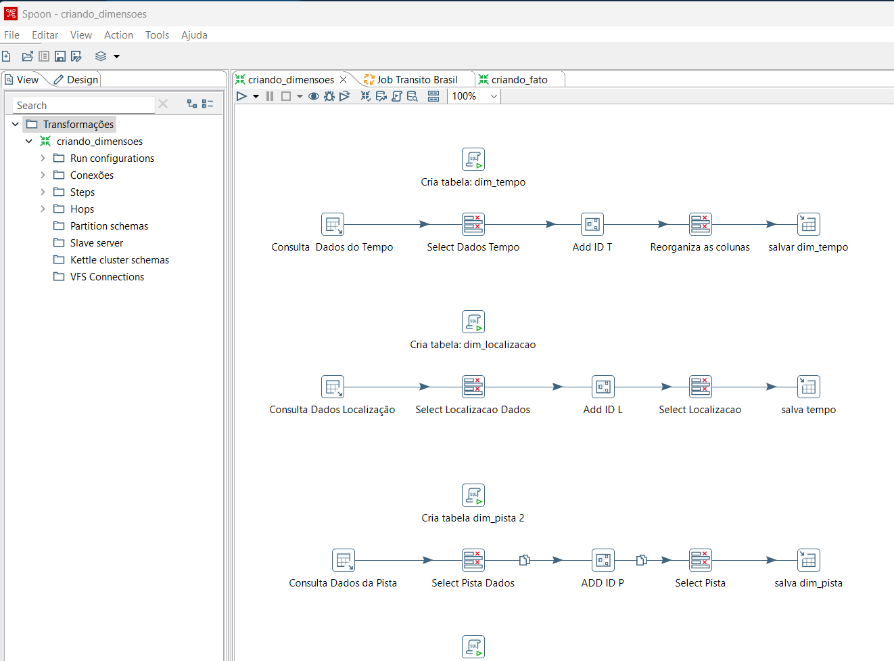
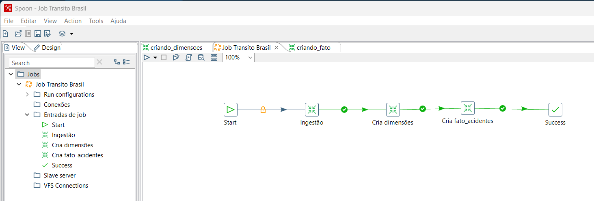
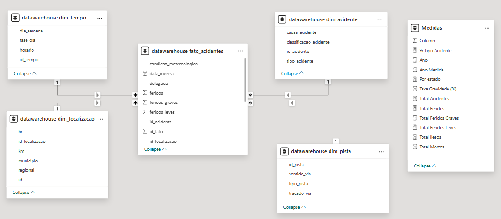
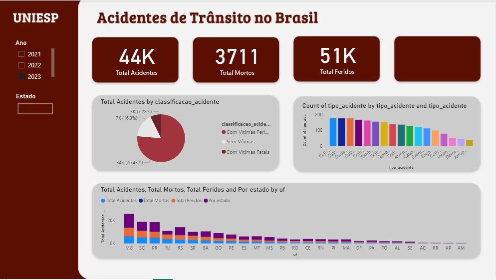
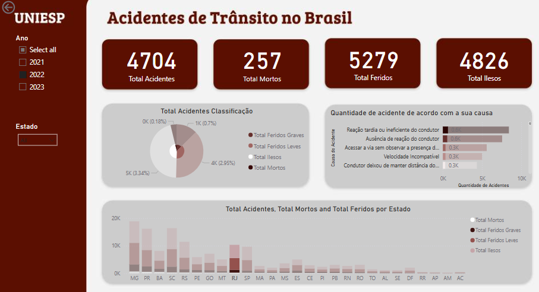

# 📊 Projeto Data Warehouse – Análise de Acidentes de Trânsito no Brasil

## 📌 Descrição do Projeto

Este projeto tem como objetivo a construção de um Data Warehouse para análise dos acidentes de trânsito registrados no Brasil entre 2021 e 2023. A solução utiliza Pentaho Data Integration, Python e Pandas para cálculo de métricas e o PostgreSQL para armazenamento estruturado. A visualização dos dados é realizada no Power BI.

A base de dados inicial contém 463.152 mil registros de 2017 até 2023 e foi disponibilizada em formato CSV no site [Kaggle](https://www.kaggle.com/datasets/mlippo/car-accidents-in-brazil-2017-2023). O projeto segue uma abordagem baseada em modelagem dimensional, utilizando tabelas fato e dimensões para facilitar a análise dos dados.

## 🎯 Objetivos

- Desenvolvimento de pipelines ETL robustos e automatizados com Pentaho e PostgreSQL, garantindo eficiência e integridade dos dados.

- Modelagem e implementação de Data Warehouses otimizados para análise de dados, utilizando boas práticas com Pentaho e PostgreSQL.

- Extração, tratamento e análise de dados com Python, utilizando bibliotecas como Pandas para geração de insights e apoio à tomada de decisão.

- Criação de dashboards interativos e visualmente informativos no Power BI, com foco em indicadores estratégicos e navegação intuitiva.

## 🔧 Tecnologias Utilizadas

- Python
- Pentaho Data Integration
- PostgreSQL 
- Power BI 

## 🛠️ Passo a Passo da Implementação

1) **Ingestão, Transformação, Modelagem Dimensional e Armazenamento dos Dados** 

    No Pentaho foram desenvolvidas três transformações principais:

    - **criando_tabelas**.ktr: realiza a leitura dos dados a partir de um arquivo .csv, estabelece conexão com o banco de dados PostgreSQL e cria uma tabela inicial contendo os dados brutos.

    - **criando_dimensoes**.ktr: estrutura e popula as tabelas dimensionais de tempo, localização e pista, a partir da seleção dos dados relevantes. Gera chaves primárias (IDs) para cada dimensão e armazena as informações no banco de dados.

    - **criando_fato**.ktr: constrói uma tabela temporária com os dados brutos e adicionando as chaves estrangeiras id_tempo, id_localizacao e id_pista, obtidas das tabelas dimensionais. Em seguida, gera a tabela fato_acidentes, contendo apenas os IDs dimensionais e os atributos quantitativos, descartando as colunas redundantes.

        

    Execução utilizando um JOB
    [Job Transito Brasil]('pentaho/job_transito_brasil.kjb')

    
    
    
3) **Modelagem Dimensional - Esquema Estrela**

    Um esquema em estrela é um modelo multidimensional que organiza os dados em um banco de dados para torná-los mais fáceis de entender e analisar. O design do esquema em estrela é otimizado para consultar grandes conjuntos de dados. A imagem abaixo ilustra os dados após a modelagem.

    

3) **Análises de dados iniciais utilizando Python**

    O Pandas foi utilizado nas análises iniciais para realizar a leitura, exploração, limpeza e tratamento dos dados, permitindo uma compreensão prévia dos padrões e inconsistências no dataset. 

    O [notebook](notebooks/analises_gerais.ipynb) com todo o processo de análise, tratamento e modelagem dos dados pode ser consultado para acompanhar as etapas realizadas de forma detalhada e reproduzível.

## 📊 Storytelling e Análises

    Nesta seção, os dados tratados e modelados foram explorados por meio de visualizações interativas desenvolvidas no Power BI. O objetivo é transformar informações técnicas em narrativas visuais claras e acessíveis, destacando padrões, tendências e comportamentos relevantes. Os dashboards permitem uma análise dinâmica, facilitando a interpretação dos dados e apoiando a tomada de decisões estratégicas com base em evidências.

Os dados analisados ajudaram a responder as perguntas abaixo:

    1) Quais estados brasileiros registraram mais acidentes ao longo dos anos?

        Os estados que apresentam maior quantidade de acidentes são 
        - 2021: MG
                SC
                PR
                
        - 2022:
        - 2023:

    2) Qual o impacto das condições climáticas na quantidade de acidentes?
    3) Há um padrão entre horário/dia da semana e número de acidentes?
    4) Quais são os tipos de acidentes mais frequentes?

## Power BI

